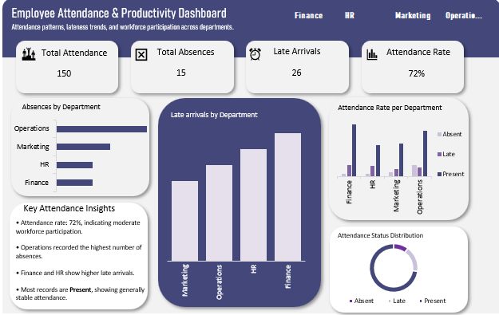

# Employee Attendance & Productivity Analysis

## Project Story

During my data analytics internship, I worked on an **Employee Attendance dataset** to understand patterns in employee attendance, lateness, and absenteeism across departments.

Employee attendance plays a critical role in **productivity, team coordination, and organizational efficiency**. The goal of this project was to transform raw attendance records into meaningful insights that help management understand workforce participation and make informed decisions.

Using **Microsoft Excel**, I cleaned the dataset, analyzed attendance patterns, and built an **interactive dashboard** that visually presents key attendance metrics and departmental trends.

---

## Business Problem

Organizations often struggle to track attendance trends and identify patterns behind employee lateness and absences.

Without proper analysis, HR teams may find it difficult to:

- Monitor attendance performance across departments  
- Identify departments with high absenteeism  
- Detect patterns of frequent lateness  
- Make data-driven workforce decisions  

This project focuses on analyzing attendance data to uncover these patterns and provide actionable insights for improving attendance management.

---

## Dataset Overview

The dataset contains employee attendance records with the following fields:

- Employee ID  
- Department  
- Date  
- Check-in Time  
- Work Hours  
- Attendance Status (Present, Late, Absent)

The dataset covers multiple departments including:

- Finance  
- HR  
- Marketing  
- Operations  

This structure allows attendance behavior to be analyzed both at the **employee level** and **departmental level**.

---

## Data Cleaning Process

Before analysis, the dataset required several preparation steps to ensure accuracy and consistency.

### Date Formatting

The **Date** column contained mixed formats (MDY and DMY). These were standardized for proper chronological analysis.

### Handling Missing Values

Some records had missing **Check-in Time** and **Work Hours**.  
After review, these corresponded to employees marked as **Absent**, so no imputation was necessary.

### Data Validation

Attendance status values were reviewed to ensure consistency:

- Present  
- Late  
- Absent  

These steps ensured the dataset was clean and ready for analysis.

---

## Key Performance Indicators (KPIs)

From the dataset, the following KPIs were calculated:

- **Total Attendance Records:** 150  
- **Total Absences:** 15  
- **Total Late Arrivals:** 26  
- **Overall Attendance Rate:** 72%  

These metrics provide a concise summary of overall attendance performance.

---

## Key Insights

- The overall attendance rate is **72%**, indicating moderate workforce participation.  
- The **Operations department recorded the highest number of absences**.  
- **Late arrivals were observed across multiple departments**, particularly in Finance and HR.  
- Lateness remains a recurring attendance issue, despite most employees being present.  

These insights highlight areas where organizations can improve attendance management.

---

## Dashboard

To make the insights easier to interpret, an **interactive Excel dashboard** was created to visualize key attendance metrics and departmental patterns.  

The dashboard allows quick monitoring of attendance performance and identification of departments with attendance challenges.

### Dashboard Preview

  
   
  <em>Employee Attendance Dashboard – Visualizing Departmental Trends</em>

---

## Tools Used

- Microsoft Excel  
- Pivot Tables  
- Excel Charts  
- Excel Dashboard Design  

---

## Conclusion

This project demonstrates how **data analytics can uncover meaningful insights** from employee attendance records.  

While most employees maintain regular attendance, the analysis highlights opportunities to improve **punctuality** and reduce **absenteeism**.  

By leveraging data-driven insights, organizations can strengthen attendance monitoring and improve overall workforce productivity.
